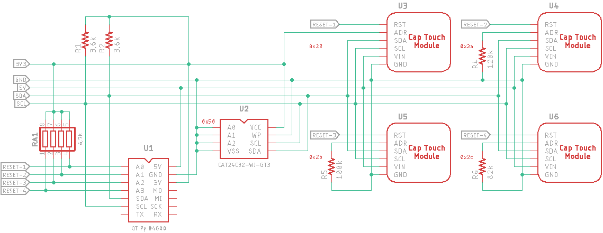

# Cap Touch Host Project

## Introduction

This project provides two board designs supporting capacitive touch sensing. The host board supports up to (4) cap touch sensor modules using Microchip's [CAP1188](https://www.digikey.com/en/products/detail/microchip-technology/CAP1188-1-CP-TR/3871672) IC ([datasheet](https://ww1.microchip.com/downloads/en/DeviceDoc/00001620C.pdf)) supporting (32) capacitive touch surfaces . A 5th Adafruit CAP1188 board could be used by connecting it to the MCU's Qwiic/STEMMA QT port with 5V to the VIN pin.

## The Sensor Board

The sensor board is similar to Adafruit's CAP1188 ([#1602)](https://www.adafruit.com/product/1602) board, but without level-shifting, LEDs, and access to the WAKE and ALERT pins. The ADDR_COMM and RESET pins are routed to the host board. The I2C pull-up resistors have been moved to the host board since four of five sensor modules could be in parallel, plus EEPROM or other components.. The LDO voltage regulator chip has been left on-board for better power distribution.

It should be noted that there are no pull-up resistors for the CAP1188's LED driver, so the LED drive mode will have to be changed from "open-drain" to "push-pull" mode. The output logic level can be inverted to provide a positive signal to trigger solid state relays requiring positive logic.

The default LED drive mode is open-drain such that when a switch is triggered, an n-channel MOSFET is turned-on switching the MOSFET drain and LED cathode to ground, illuminating the LED since its anode is pulled high.

The Cap Sensor inputs (CS1-8) and LED outputs (LED1-8) are not routed through the host board. Outputs can be wired directly from the sensor board when needed - otherwise, switch status can be read from the status registers via I2C.

 

### Schematic

### Parts List

| Component |            Description             | Quan. |                         Part Number                          | Notes |
| :-------: | :--------------------------------: | :---: | :----------------------------------------------------------: | ----- |
|    U1     |      Cap Touch Sensor 24VQFN       |   1   | Microchip [CAP1188-1-CP-TR](https://www.digikey.com/short/jdhph3bp) |       |
|    U2     | LDO 3V3 Voltage Regulator SOT-23-5 |   1   | Microchip [MIC5225-3.3YM5-TR](https://www.digikey.com/short/h5855rbn) |       |

2x4 and 2x5 headers and housings may be useful. Through-hole pattern: 0.1" pitch, 0.040" holes.

##  The Host Board

The host board provides a microcontroller (MCU), Adafruit QT Py SAMD21 ([#4600](https://www.adafruit.com/product/4600)) and I2C EEPROM IC, and hosts (4) Sensor boards. It provides 5V power via the USB-C pc-host or charging cable, and 3.3V I2C pull-up via the MCU's 3V3 voltage regulator.

Each of the RESET lines is pulled high and controlled by the MCU so that the MCU can make configuration changes immediately after dropping the RESET line to a logic low.

Each of the sensor module's ADDR_COMM pins are set to a different I2C address. U3 (module #1) uses the default address of 0x28. Address 0x29 (program resistor = 150kΩ) is available so that an unmodified Adafruit CAP1188 module can be attached via the QT Py MCU's Qwiic/STEMMA QT port. I2C addresses are printed on the PC board and schematic.

### Host Board Schematic

### Parts List

| Component |          Description          | Quan.  |                         Part Number                          | Notes                          |
| :-------: | :---------------------------: | :----: | :----------------------------------------------------------: | ------------------------------ |
|    U1     |       QT PY SAMD21 MCU        |   1    |   Adafruit [#4600](https://www.digikey.com/short/b2fc2jh4)   | Microcontroller                |
|    U2     |  IC EEPROM 32KBIT I2C 8-SOIC  |   1    | ON Semi [CAT24C32WI-GT3](https://www.digikey.com/short/5h0p7b04) | EEPROM memory for config.      |
|    RA1    | RES ARRAY 4 RES 6.8K OHM 1206 |  1 *   | Bourns [CAT16-682J4LF](https://www.digikey.com/short/hrmr0547) | RESET pull-ups.                |
|  R1, R2   |    RES 3.3kΩ 5% 1/4W 1206     |   2    | Stackpole [RMCF1206JT3K30](https://www.digikey.com/short/57h2z201) | I2C pull-ups.                  |
|    R4     |    RES 120kΩ 1% 1/4W 1206     | 0 or 1 | Stackpole [RMCF1206FT120K](https://www.digikey.com/short/3tnptfrc) | Sets I2C address of module O4. |
|    R5     |    RES 100kΩ 1% 1/4W 1206     | 0 or 1 | Stackpole [RMCF1206FT100K](https://www.digikey.com/short/2pfhhrhr) | Sets I2C address of module U5. |
|    R6     |     RES 82kΩ 1% 1/4W 1206     | 0 or 1 | Stackpole [RMCF1206FT82K0](https://www.digikey.com/short/r0n5dq3d) | Sets I2C address of module U6. |

**Note**:

* Resistor array RA1  may not be necessary if:
  *  the GPIO lines default to a weak-pull-up INPUT mode or
  * you don't care that the **FIXME** ???
*  there's no pull-down resistor on the RESET pin of this sensor module. (10kΩ pull-down on the Adafruit board.)
* There is no resistor R3 since the address programming resistor was removed to allow use with an Adafruit CAP1188 board.

## FIXME - Add notes on RESTART, LED Drive, Invert, ...

## Status

|    Date    | Status                                                       |
| :--------: | ------------------------------------------------------------ |
| 2023-04-04 | Posted board files.                                          |
| 2023-03-13 | Posted to GitHub.                                            |
| 2023-03-12 | Concept posted to ATMakers FB [group](https://www.facebook.com/groups/ATMakers). |

No one in the target group has an immediate need for theses boards so none are being procured at the moment. Hence there's been no testing of a delivered product or software.

## Todo

* Create board markdown files.
