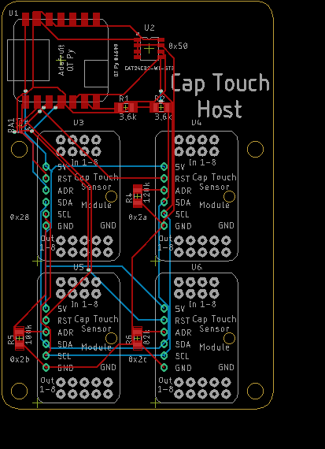
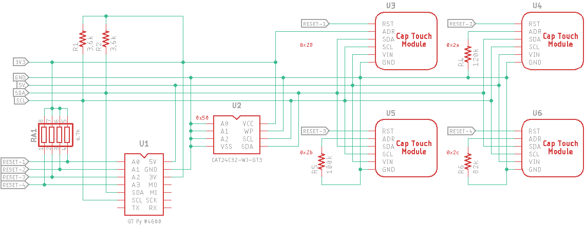

# Cap Touch Host Board

## The Host Board

The host board is populated with an Adafruit QT Py SAMD21 ([#4600](https://www.adafruit.com/product/4600)) microcontroller (MCU) and I2C EEPROM IC. It hosts (4) Sensor boards. It provides 5V and 3.3V power via a USB-C pc-host or charging cable connected to the MCU.

### Power

#### 5V

The Host board provides 5V power to each of the Sensor boards which is then regulated to 3.3V by each of the Sensor boards. 5V is sourced from the QT Py's USB-C 5V pin.

#### 3.3V

3.3V power is provided from the MCU's 3.3V regulator to:

* the I2C EEPROM's Vdd pin
* pull up the I2C SDA and SCL lines
* the resistor array for RESET line pull-up
* the first Sensor board's ADR pin.

### Reset

The MCU controls the Sensor RESET pins. Currently, they are pulled high via resistor array RA1. There is no pull-down resistor unless you use the Adafruit board (10kΩ). Once the MCU is ready to configure a Sensor board it changes the pin to OUTPUT mode and sets it LOW.

### I2C

Each of the sensor module's ADDR_COMM pins are set to a different I2C address. U3 (module #1) uses the default address of 0x28. Address 0x29 (program resistor = 150kΩ) is available so that an unmodified Adafruit CAP1188 module can be attached via the QT Py MCU's Qwiic/STEMMA QT port. I2C addresses are printed on the PC board and schematic.

### CAP1188 Cap Sense and LED Pins

None of the CAP1188's CS or LED pins are routed through the Host board, but rather wired directly from the Sensor board to the touch surface or switch controlled device, respectively.

### Host Board Image

### Host Board Schematic

### Parts List

| Component |          Description          | Quan.  |                         Part Number                          | Notes                          |
| :-------: | :---------------------------: | :----: | :----------------------------------------------------------: | ------------------------------ |
|    U1     |       QT PY SAMD21 MCU        |   1    |   Adafruit [#4600](https://www.digikey.com/short/b2fc2jh4)   | Microcontroller                |
|    U2     |  IC EEPROM 32KBIT I2C 8-SOIC  |   1    | ON Semi [CAT24C32WI-GT3](https://www.digikey.com/short/5h0p7b04) | EEPROM memory for config.      |
|    RA1    | RES ARRAY 4 RES 6.8K OHM 1206 |  1 *   | Bourns [CAT16-682J4LF](https://www.digikey.com/short/hrmr0547) | RESET pull-ups.                |
|  R1, R2   |    RES 3.3kΩ 5% 1/4W 1206     |   2    | Stackpole [RMCF1206JT3K30](https://www.digikey.com/short/57h2z201) | I2C pull-ups.                  |
|    R4     |    RES 120kΩ 1% 1/4W 1206     | 0 or 1 | Stackpole [RMCF1206FT120K](https://www.digikey.com/short/3tnptfrc) | Sets I2C address of module U4. |
|    R5     |    RES 100kΩ 1% 1/4W 1206     | 0 or 1 | Stackpole [RMCF1206FT100K](https://www.digikey.com/short/2pfhhrhr) | Sets I2C address of module U5. |
|    R6     |     RES 82kΩ 1% 1/4W 1206     | 0 or 1 | Stackpole [RMCF1206FT82K0](https://www.digikey.com/short/r0n5dq3d) | Sets I2C address of module U6. |

**Notes**:

* Resistor array RA1  may not be necessary because the MCU GPIO lines probably default to a weak-pull-up in INPUT mode,
* There is no resistor R3 since the address programming resistor was removed to allow use with an Adafruit CAP1188 board.

## Status

No Host or Sensor boards have been ordered yet.

## ToDo

* TBD